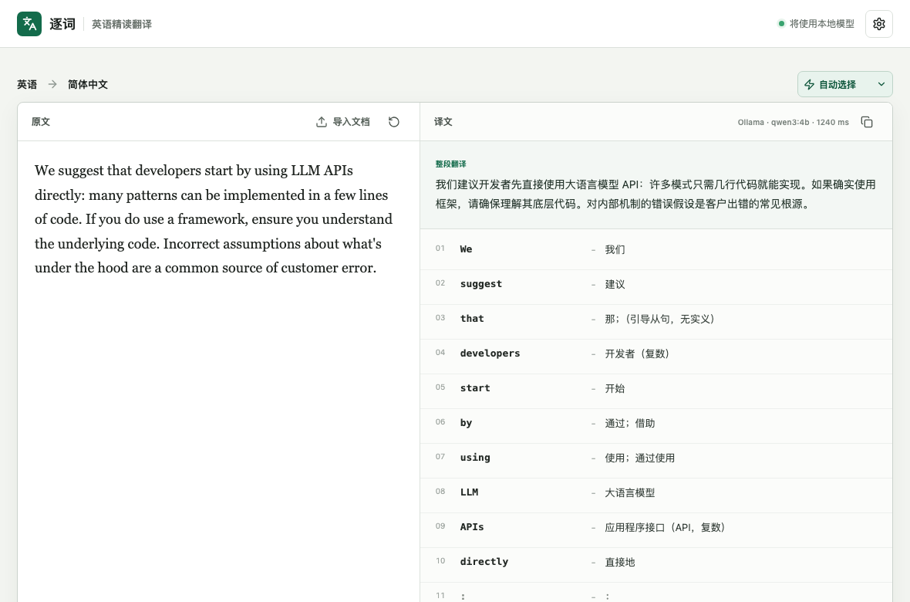

# 逐词

[](https://github.com/fly1d/wordwise/actions/workflows/ci.yml)
[](https://github.com/fly1d/wordwise/actions/workflows/desktop.yml)
[](https://github.com/fly1d/wordwise/actions/workflows/codeql.yml)
[](LICENSE)

本地优先的英中逐词翻译工具，提供 macOS 桌面客户端和 Web 界面。文本先被确定性拆成词元，再交给翻译引擎；模型返回会被校验，不能随意漏词或合并词语。

产品介绍与 Founder Beta 申请：[fly1d.github.io/wordwise](https://fly1d.github.io/wordwise/?source=github)

[](https://fly1d.github.io/wordwise/?source=github)

## 功能

- macOS 中选中文字后按默认快捷键 `⌥ + K`，打开客户端并立即翻译；可在设置中关闭或修改
- 自动、Ollama、OpenAI 兼容 API、极速词典四种引擎
- 整段中文译文与逐词、数字、标点对齐结果
- TXT、Markdown、DOCX、PDF 文本提取
- 桌面与手机响应式 Web 界面

## Web 开发

需要 Node.js 22.13 或更高版本。

```bash
npm ci
npm run dev
```

打开 `http://localhost:5173`。

## macOS 客户端

首次构建需要 Rust stable 和 Xcode Command Line Tools。
完整的中文构建与配置步骤见 [docs/building.md](docs/building.md)。

```bash
rustup toolchain install stable
npm ci
npm run tauri dev
```

全局划词需要在“系统设置 → 隐私与安全性 → 辅助功能”中允许逐词。客户端会优先通过 macOS Accessibility API 读取选区；不支持该属性的应用会使用复制回退，并可能请求“自动化 → System Events”权限。复制回退会短暂使用系统剪贴板：客户端先在内存中快照全部项目及其已声明格式，只在 `changeCount` 仍符合候选版本时恢复；恢复开始前已观察到的额外或意外变化会保留较新内容并取消本次捕获。剪贴板快照不会发送给翻译引擎，恢复后的快照仅保留在当前 Mac。macOS 不提供写入者身份或原子条件恢复，因此复制回退仍有无法完全消除的并发边界；Copy 已发出但捕获未安全完成时，本次运行会停用复制回退，需检查当前剪贴板并重启逐词。关闭选区快捷键只会取消全局快捷键注册，不会撤销已经授予的系统权限。

生成本地 `.app`：

```bash
npm run desktop:build:app
```

## 翻译引擎

- `自动选择`：优先使用可用的 Ollama；未检测到本地模型时使用已配置的云端 API。两者都不可用时会提示配置，不会把基础词典冒充成语境翻译。
- `Ollama`：默认连接本机服务，建议使用 `qwen3:4b` 或更大的 Qwen 模型；改为远程地址时，内容会发送到该服务。
- `云端模型`：支持 OpenAI 及兼容 `/chat/completions` 的 API。
- `极速词典`：完全离线、即时返回，只用于逐词查义，不提供可靠的整句语境翻译。

本地模型示例：

```bash
ollama pull qwen3:4b
ollama serve
```

服务端环境变量示例：

```bash
OLLAMA_BASE_URL=http://127.0.0.1:11434 \
OPENAI_BASE_URL=https://api.openai.com/v1 \
OPENAI_API_KEY=... OPENAI_MODEL=gpt-5-mini npm run dev
```

API Key 不会写入浏览器存储。使用云端模型或远程 Ollama 地址时，选中文字、手动输入内容或提取出的文档文字会发送给用户配置的服务；使用默认本机 Ollama 地址或极速词典时不会发送到云端。公共云端凭据不得编译到前端或桌面安装包中。
Web 服务只会请求上述服务端环境变量配置的模型地址，页面中地址为只读；这可防止浏览器借用本地 API 访问其他内网服务。macOS 客户端直接在本机发起模型请求，仍允许用户在设置中修改兼容 API 地址。

## 质量门禁

```bash
npm run check
npm run test:smoke
npm run test:site
npm run desktop:check
```

所有修改通过 GitHub pull request 合并。风险分级、测试范围和发布步骤见 [CONTRIBUTING.md](CONTRIBUTING.md)、[docs/testing.md](docs/testing.md) 和 [docs/releasing.md](docs/releasing.md)。首批用户与付费验证按 [docs/validation.md](docs/validation.md) 执行，不以下载量或口头好评替代付款证据。

安全问题请按 [SECURITY.md](SECURITY.md) 使用 GitHub 私密漏洞报告，不要提交包含密钥、私有选区或文档内容的公开 Issue。

## 当前限制

- 全局划词 beta 目前只支持 macOS。
- 文档功能提取文字后翻译，尚未保持原文档版式导出。

## 许可证

本项目采用 [MIT License](LICENSE)。
